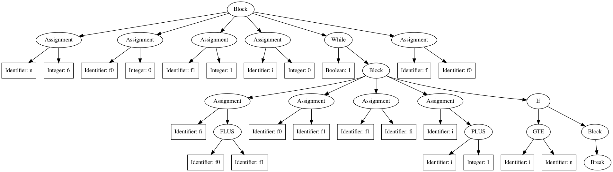

We'll work on generating an intermediate representation for a source program, to be passed on to later phases of the compiler.  Specifically, we'll modify the Python parser from assignment 2 to generate an abstract syntax tree (AST) representing the source program.  In addition, we'll take a first stab at generating code using this AST by generating a GraphViz specification of the AST itself.  This will enable us to visualize the AST.

There are a few major parts to this assignment, described below.  To get you started, you are provided with a Flex scanner specification in `scanner.l` and a Bison parser specification in `parser.y` that, together with the `main()` function in `main.cpp`, solve the problem defined in assignment 2.  There is also a makefile that specifies compilation for the parser.  Instead of using these files, you may also start with your own solution to assignment 2, if you'd like.

## Implement one or more data structures for building an AST

An abstract syntax tree (AST) is a tree-based representation of the source program in which each node in the tree represents a coherent semantic construct in the source program.  An AST closely resembles a parse tree but is more compact because it eliminates or contracts many of the nodes corresponding to nonterminals.  For example, an entire if statement might be represented by a single node in an AST instead of by separate nodes for each of its individual components, as you'd see in a typical parse tree.  Our textbook discusses ASTs in more detail, and Wikipedia also has [a helpful article about them](https://en.wikipedia.org/wiki/Abstract_syntax_tree).

You can also see visualizations of example ASTs in the `example_output/` directory.  For example, here's an AST corresponding to `testing_code/p4.py` (the Fibonacci function):



Your first task in this assignment is to implement a set of one or more data structures that allow you to construct an AST for a source program written in the same subset of Python we worked with for assignment 2.  To do this, you'll have to figure out what specific language constructs need to be represented by AST nodes, what data might be associated with each of these nodes, and how each type of node connects to other nodes in the AST.

There are different approaches to this problem.  For example, you might implement a single, general purpose C++ class or C structure, capable of representing all programmatic constructs in the source language.  Then, each time your parser encountered any kind of program construct, it would create a new object of this class/structure, add the appropriate data to represent the recognized construct, and pass the newly-created node up in the parse tree (i.e. by assigning the node to `$$` in a Bison-based parser) to be combined with higher-level nodes.

Alternatively, you might implement separate classes/structures to represent the various different kinds of programmatic constructs in the source language.  For example, you might have a C++ class or C structure to represent all statements, one to represent all expressions, etc.  Each of these might have further specializations.  For example, you could implement a C++ class to represent all statements, and then use inheritance to implement derived classes representing assignment statements, if/elif/else statements, while statements, etc.

An implementation taking this latter approach might, for example, include a C++ class or C structure to represent an AST node corresponding to a binary operation expression (e.g. `expr OP expr`) in the source language.  Your class/structure might contain a field to represent the specific operator associated with the expression, and it might contain two pointers to other AST nodes, one representing the left-hand side of the binary operation and another representing the right-hand side of the binary operation.  These LHS and RHS nodes might have additional children, or they could represent identifiers, floats, integers, etc. that have no children.  If this implementation also had classes/structures for nodes representing higher-level language constructs, such as assignment statements, the binary operation expression node could be a child of one of these higher-level nodes.

## Modify the parser to use your data structures to build an AST

Your next task is to modify the parser included in the starter code (or your own parser from assignment 2) to build an AST using the data structures you defined above.  The general idea here is to modify the actions associated with each of the parser's grammar rules to return an AST node instead of returning a string of C++ code.  This node will then potentially be combined with other nodes when a higher-level construct is recognized.

Though the end goal here is different from the goal of assignment 2, the mechanics will be similar to generating a C++ translation.  In particular, to generate a string containing a C++ translation for the language construct on the left-hand side of a particular grammar production, you assumed that you had C++ strings for the language constructs on the right-hand side of the production (specifically in `$1`, `$2`, `$3`, etc.), and you concatenated these together (along with proper punctuation, etc.) to form the left-hand side's C++ string (i.e. `$$`).

Similarly, when building an AST node for a language construct on the left-hand side of a grammar production, you should assume that you have AST nodes for the relevant language constructs on the right-hand side of the production (in `$1`, `$2`, `$3`, etc.), and you can use these to generate the node for the production's left-hand side construct (i.e. `$$`).  For example, you could pass the `$n`'s to a function or class constructor that generates an AST node for the production's left-hand-side language construct and then assign that generated node to `$$`.

You'll have to do a few other things in the parser to get this all working, as well.  For example, the current parser uses the type `std::string*` for all grammar symbols.  You'll instead have to use the appropriate AST node class/structure as the type for each nonterminal symbol.  You'll likely want to continue to represent all terminals with `std::string*`, since the values for the terminals will come from the scanner, and you don't necessarily want your scanner to worry about building AST nodes.  The scanner may or may not need minor changes to make everything work.

Once you have the parser building your AST, save the root node of the AST in a global variable, similar to the way the current parser provided in the starter code saves the entire translated program string in a global variable.  If you'd like proof that the parser is correctly building an AST at this point, you can modify the `main()` function to print out some information about the AST using this global variable.

## Use your AST to generate a GraphViz specification to visualize the AST

Finally, to get practice generating code from an AST, implement functionality to use your AST to generate its own [GraphViz](http://www.graphviz.org/) specification.  You should specifically write a specification that can be passed to the [`dot`](https://graphviz.gitlab.io/_pages/pdf/dotguide.pdf) program (which is installed on the ENGR servers) to generate a visualization of the AST.

GraphViz uses a very simple notation for representing trees and graphs.  Here's an example of a simple GraphViz tree specification:
```
digraph G {
  a [label="Node A"];
  b [label="Node B"];
  c [label="Node C"];
  d [label="Node D"];
  e [label="Node E"];
  f [label="Node F"];
  g [label="Node G"];
  h [label="Node H"];

  a -> b;
  a -> c;
  a -> d;
  c -> e;
  d -> f;
  e -> g;
  e -> h;
}
```

Here, we create a new directed graph (i.e. a "digraph") in which each node is first declared and assigned a label (i.e. a string to be printed inside the node in the visualization of the tree).  Following the node declarations, all (directed) edges in the tree are represented using the `->` operator.

Assuming this file was named `tree.gv`, we could use it to generate a PNG image visualizing the specified tree with the following command:
```
dot -Tpng -otree.png tree.gv
```
This is the image that would be produced (in `tree.png`):


The GraphViz specification is flexible, and nodes and edges can be defined in any order, with edges even possibly appearing before the corresponding nodes are declared.  One important constraint on the GraphViz specification is that each node must have a unique identifier (`a`, `b`, `c`, `d`, etc. in the sample specification above).  More info on additional visualization options is available in the documentation linked above.

To generate a GraphViz specification for your AST, you should write one or more functions that generate GraphViz code for each of your AST node classes/structures (e.g. one function per class/structure).  Each of these functions should generate the relevant GraphViz code for the node itself (e.g. a label for the node indicating the language construct it represents and specifications of the edges to the node's children).  They should then recursively call other functions to generate GraphViz code for each of the node's children.  The practice of recursively traversing the AST in this way to generate GraphViz code closely resembles the way assembly code is generated from an AST, e.g. using LLVM.

Two primary design considerations when writing your traversal/code generation functions will be how to ensure that each AST node is given a unique identifier in the GraphViz specification and how to concatenate together all of the GraphViz code produced for the individual AST nodes.

You should use your code generation functions by invoking them on the root node of the AST from your `main()` function, and you should output the generated GraphViz code to stdout, so it can be inspected or saved to a file.

## Testing your code

There are some simple Python programs you may use for testing your AST builder included in the `testing_code/` directory.  Example outputs (both a `.png` visualization and a `.gv` GraphView specification) for these programs are included in the `example_output/` directory.  Note that the ASTs your parser generates may be slightly different than the ones included here, depending on how you choose to represent nodes in the AST.  This is OK, as long as your generated ASTs accurately capture the structure of each input program.
